# Zed ACP Agent 认证流程深度调研

> 基于 Zed 源码分析，涵盖 ACP Registry 安装后 Agent 登录按钮的处理流程、不同登录方式的处理机制、多 Session 凭证共享策略、凭证存储与过期处理。

## 目录

1. [整体架构概览](#1-整体架构概览)
2. [点击登录按钮后的完整流程](#2-点击登录按钮后的完整流程)
3. [不同登录方式 (AuthMethod) 与 MethodId 处理](#3-不同登录方式-authmethod-与-methodid-处理)
4. [多 Session 共享凭证机制](#4-多-session-共享凭证机制)
5. [凭证存储策略](#5-凭证存储策略)
6. [凭证过期与重新认证](#6-凭证过期与重新认证)
7. [关键源码索引](#7-关键源码索引)

---

## 1. 整体架构概览

Zed 的 ACP Agent 认证架构分为三层：

```
┌─────────────────────────────────────────────────────┐
│  UI 层 (agent_ui crate)                             │
│  ConversationView → AuthState 状态机 → 渲染登录按钮 │
├─────────────────────────────────────────────────────┤
│  连接层 (agent_servers crate)                       │
│  AcpConnection → AgentConnection trait              │
│  管理 auth_methods、terminal_auth_task、authenticate│
├─────────────────────────────────────────────────────┤
│  协议层 (agent-client-protocol crate)               │
│  InitializeRequest/Response、AuthenticateRequest    │
│  AuthMethod、AuthMethodId、ErrorCode::AuthRequired  │
└─────────────────────────────────────────────────────┘
          │
          ▼ (JSON-RPC over stdio)
┌─────────────────────────────────────────────────────┐
│  Agent 进程 (外部二进制/npx 包)                     │
│  自行管理凭证存储、Token 刷新、登录交互             │
└─────────────────────────────────────────────────────┘
```

**核心设计原则**：Zed 不管理 ACP Agent 的凭证。认证完全委托给 Agent 进程本身，Zed 只负责：
- 发现 Agent 支持的认证方法（`auth_methods`）
- 触发认证（发送 `AuthenticateRequest` 或打开终端执行登录命令）
- 检测认证失败（`ErrorCode::AuthRequired`）并在 UI 上引导用户重新登录

---

## 2. 点击登录按钮后的完整流程

### 2.1 认证需求的触发

认证需求通过两种方式触发：

**方式 A：新建 Session 时 Agent 返回 `AuthRequired`**

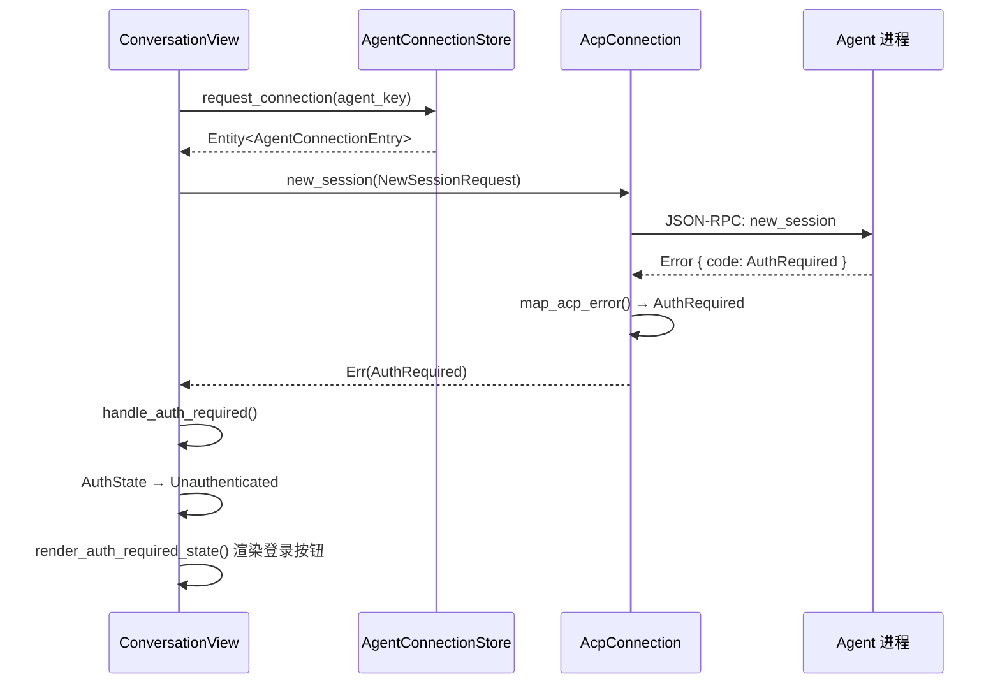

源码位置：`conversation_view.rs:877-891`

```rust
let result = match result.await {
    Err(e) => match e.downcast::<acp_thread::AuthRequired>() {
        Ok(err) => {
            cx.update(|window, cx| {
                Self::handle_auth_required(this, err, agent.agent_id(), connection, window, cx)
            }).log_err();
            return;
        }
        Err(err) => Err(err),
    },
    Ok(thread) => Ok(thread),
};
```

**方式 B：发送 Prompt 时 Agent 返回 `AuthRequired`**

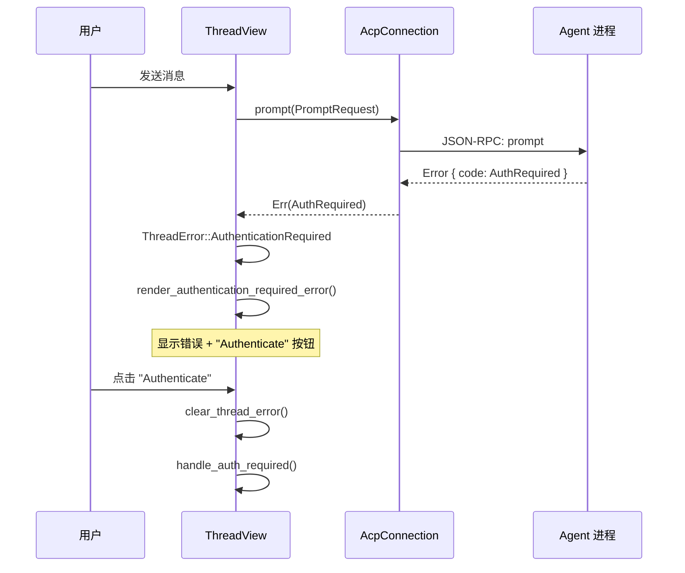

源码位置：`acp.rs:975-979`

```rust
Err(err) => {
    if err.code == acp::ErrorCode::AuthRequired {
        return Err(anyhow!(acp::Error::auth_required()));
    }
    // ...
}
```

### 2.2 `handle_auth_required` — 状态切换

`handle_auth_required` 是认证流程的核心入口（`conversation_view.rs:1163-1243`）：

1. 如果 `AuthRequired` 包含 `provider_id`（语言模型提供商认证），则：
   - 订阅 `LanguageModelRegistry` 事件
   - 当提供商认证状态变更（`ProviderStateChanged`）且已认证时，自动调用 `this.reset()` 恢复会话
   - 渲染提供商的配置界面（API Key 输入框等）

2. 否则（ACP Agent 自身认证），则：
   - 将 `auth_state` 设为 `AuthState::Unauthenticated`
   - 携带 Agent 返回的 `description`（Markdown 格式的认证说明）
   - `pending_auth_method` 设为 `None`（等待用户选择认证方式）

```rust
enum AuthState {
    Ok,
    Unauthenticated {
        description: Option<Entity<Markdown>>,
        configuration_view: Option<AnyView>,
        pending_auth_method: Option<acp::AuthMethodId>,
        _subscription: Option<Subscription>,
    },
}
```

### 2.3 渲染登录按钮

`render_auth_required_state()`（`conversation_view.rs:1979-2092`）根据 `auth_methods` 渲染按钮：

- 如果只有 **1 个**认证方法：显示一个 `Callout` + 右侧一个按钮
- 如果有 **多个**认证方法：显示 "Choose one of the following authentication options:" + 多个按钮
- 如果有 `pending_auth_method`（正在认证中）：显示旋转加载动画
- 按钮按倒序排列，第一个使用 `TintColor::Accent` 强调色

每个按钮绑定 `on_click` 事件，调用 `this.authenticate(method_id)`。

### 2.4 `authenticate()` — 执行认证

`authenticate()`（`conversation_view.rs:1638-1773`）根据认证方式分两条路径：

#### 路径 A：终端认证（Terminal Auth）

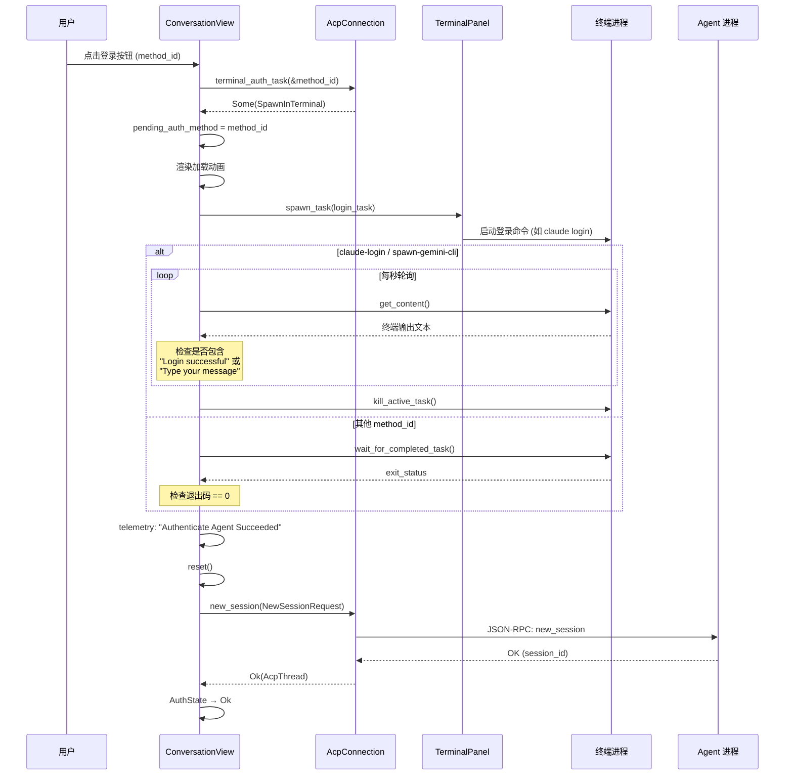

```rust
if let Some(login_task) = connection.terminal_auth_task(&method, cx) {
    // 打开终端执行登录命令
    let login = login_task.await?;
    Self::spawn_external_agent_login(login, workspace, project, method, false, window, cx)
}
```

#### 路径 B：协议认证（Protocol Auth）

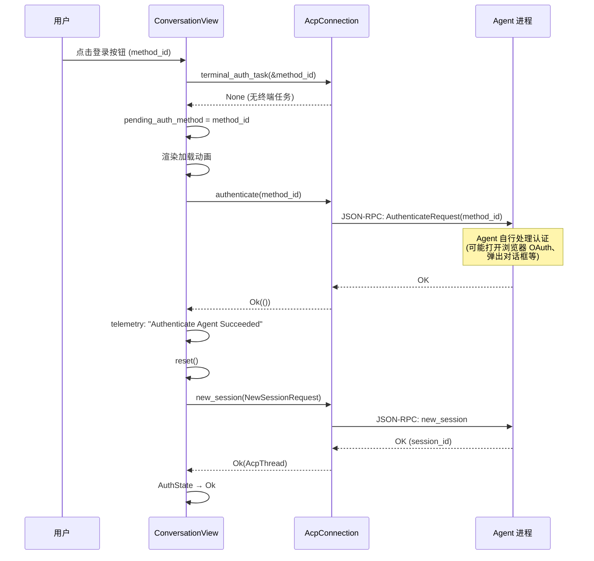

```rust
let authenticate = connection.authenticate(method, cx);
// 直接通过 ACP JSON-RPC 发送 AuthenticateRequest
authenticate.await
```

两条路径都会发送遥测事件：`"Authenticate Agent Succeeded"` 或 `"Authenticate Agent Failed"`。

### 2.5 `spawn_external_agent_login()` — 终端登录详情

源码位置：`conversation_view.rs:1840-1965`

```
1. 解析登录命令
   - 如果 command 是 "node"，解析为 Zed 管理的 Node.js 运行时路径
   - 设置 shell 参数（program + args）

2. 在终端面板中启动任务
   terminal_panel.spawn_task(&task, window, cx)

3. 判断成功的方式（按 method_id 分）:
   - "claude-login" / "spawn-gemini-cli"：
     → 每秒轮询终端输出，匹配 "Login successful" 或 "Type your message"
     → 匹配成功则认为登录完成，kill 终端任务
   - 其他 method_id：
     → 等待进程退出，检查退出码是否为 0

4. Gemini 远程服务器特殊处理：
   → 如果首次尝试失败且为远程项目，自动重试一次
```

### 2.6 `reset()` — 认证成功后恢复会话

`reset()`（`conversation_view.rs:740-776`）会：

1. 从当前 `ThreadView` 获取 `session_id`、`work_dirs`、`title`
2. 调用 `initial_state()` 重新走一遍连接 + 新建 Session 的流程
3. 此时 Agent 进程已完成认证，`new_session()` 应当返回成功
4. 设置 Session capabilities 并通知 UI 更新

---

## 3. 不同登录方式 (AuthMethod) 与 MethodId 处理

### 3.1 AuthMethod 类型

ACP 协议（`agent-client-protocol` crate）定义了三种认证方法：

| 类型 | Rust 类型 | 说明 |
|------|-----------|------|
| `Terminal` | `AuthMethodTerminal` | 一等公民终端认证，包含 `args`、`env` 等字段 |
| `Agent` | `AuthMethodAgent` | Agent 自管理认证，可选 `meta` 字段携带终端认证配置 |
| `EnvVar` | `AuthMethodEnvVar` | 环境变量认证，可选 `meta` 字段 |

每种 AuthMethod 都有一个 `AuthMethodId`（即 `MethodId`），由 Agent 在 `InitializeResponse` 中声明。

### 3.2 AuthMethod 的获取

在 `AcpConnection::stdio()` 初始化连接时（`acp.rs:323-388`）：

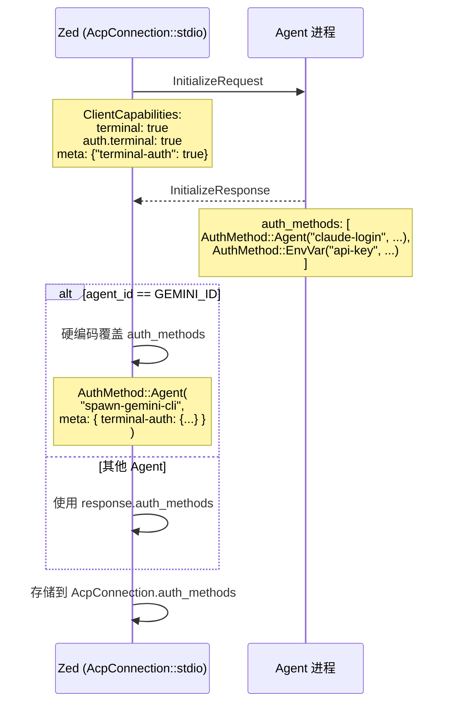

1. Zed 发送 `InitializeRequest`，声明客户端能力：
   ```rust
   acp::ClientCapabilities::new()
       .terminal(true)
       .auth(acp::AuthCapabilities::new().terminal(true))
       .meta(Meta::from_iter([("terminal-auth", true)]))
   ```

2. Agent 在 `InitializeResponse` 中返回 `auth_methods`

3. **Gemini 特殊处理**：Zed 硬编码覆盖 Gemini 的 `auth_methods`（`acp.rs:370-388`），因为 Gemini CLI 尚未发布官方 auth methods：
   ```rust
   if agent_id == GEMINI_ID {
       // 构造 AuthMethod::Agent + terminal-auth meta
       vec![acp::AuthMethod::Agent(
           acp::AuthMethodAgent::new("spawn-gemini-cli", "Login")
               .description("Login with your Google or Vertex AI account")
               .meta(meta),  // 包含 terminal-auth 配置
       )]
   } else {
       response.auth_methods  // 使用 Agent 返回的
   }
   ```

### 3.3 MethodId 如何决定认证路径

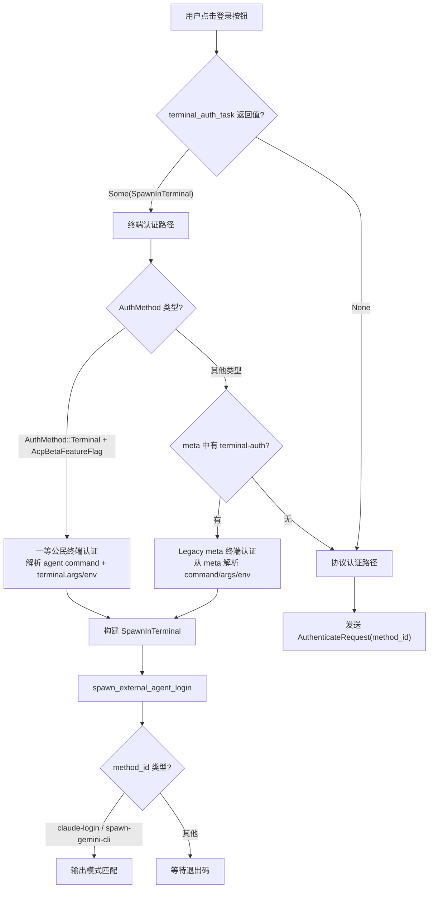

`AcpConnection::terminal_auth_task()`（`acp.rs:910-944`）根据方法类型决定走哪条路径：

```rust
fn terminal_auth_task(&self, method_id: &AuthMethodId, cx: &App) -> Option<Task<Result<SpawnInTerminal>>> {
    let method = self.auth_methods.iter().find(|m| m.id() == method_id)?;

    match method {
        // 路径 1：一等公民 Terminal 认证（需要 AcpBetaFeatureFlag）
        AuthMethod::Terminal(terminal) if cx.has_flag::<AcpBetaFeatureFlag>() => {
            // 解析 Agent 命令路径 + terminal.args + terminal.env
            // 构建 SpawnInTerminal
            Some(cx.spawn(async move |cx| { ... }))
        }
        // 路径 2：Legacy meta 终端认证（从 meta["terminal-auth"] 解析）
        _ => meta_terminal_auth_task(&self.id, method_id, method)
                .map(|task| Task::ready(Ok(task))),
    }
}
```

如果 `terminal_auth_task()` 返回 `Some`，则走 **终端认证路径**；  
如果返回 `None`，则走 **协议认证路径**（直接发送 `AuthenticateRequest`）。

### 3.4 Legacy meta 终端认证

`meta_terminal_auth_task()`（`acp.rs:533-565`）从 `AuthMethod` 的 `meta` 字段中解析 `"terminal-auth"` 配置：

```rust
#[derive(Deserialize)]
struct MetaTerminalAuth {
    label: String,
    command: String,
    args: Vec<String>,
    env: HashMap<String, String>,
}

let meta = match method {
    AuthMethod::EnvVar(env_var) => env_var.meta.as_ref(),
    AuthMethod::Terminal(terminal) => terminal.meta.as_ref(),
    AuthMethod::Agent(agent) => agent.meta.as_ref(),
    _ => None,
}?;
let terminal_auth = serde_json::from_value::<MetaTerminalAuth>(meta.get("terminal-auth")?)?;
```

这是 `AuthMethod::Terminal` 正式稳定前的过渡方案，允许任何 `AuthMethod` 类型通过 `meta` 字段携带终端认证信息。

### 3.5 已知 Agent 的 MethodId

| Agent | MethodId | 认证类型 | 登录成功检测 |
|-------|----------|----------|-------------|
| Claude Code | `"claude-login"` | Terminal (meta) | 输出包含 "Login successful" 或 "Type your message" |
| Gemini CLI | `"spawn-gemini-cli"` | Terminal (meta, 硬编码) | 输出包含 "Login successful" 或 "Type your message" |
| 其他 Agent | 自定义 | Terminal 或 Protocol | 退出码 0 或 Agent 自行处理 |

---

## 4. 多 Session 共享凭证机制

### 4.1 连接共享架构

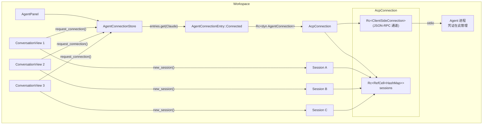

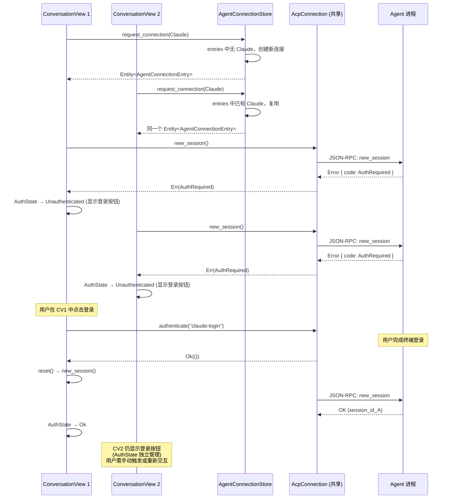

### 4.2 关键共享点

**`AgentConnectionStore::request_connection()`**（`agent_connection_store.rs:117-212`）：

```rust
pub fn request_connection(&mut self, key: Agent, server: Rc<dyn AgentServer>, cx: ...) -> Entity<AgentConnectionEntry> {
    if let Some(entry) = self.entries.get(&key) {
        return entry.clone();  // 复用已有连接
    }
    // ... 仅在不存在时创建新连接
}
```

同一个 Agent 的所有 `ConversationView`（会话标签页）共享：
- **同一个 `AgentConnectionEntry`**
- **同一个 `Rc<AcpConnection>`**
- **同一个 Agent 进程**
- **同一个 `Rc<ClientSideConnection>`**（JSON-RPC 通道）

每个 `ConversationView` 通过 `connection.new_session()` 在共享连接上创建自己的 Session。

### 4.3 凭证共享的本质

由于所有 Session 运行在同一个 Agent 进程中，凭证共享实际上由 **Agent 进程自身** 管理：

- Agent 进程在内存中保持认证状态
- 一旦某个 Session 触发了认证并成功，Agent 进程的认证状态对所有 Session 生效
- 当一个 `ConversationView` 完成认证后调用 `reset()` → `new_session()`，此时 Agent 进程不会再返回 `AuthRequired`
- **但其他已打开的 `ConversationView` 不会自动感知认证状态变更**——它们的 `AuthState` 是各自独立的。用户需要：
  - 关闭并重新打开会话标签页，或
  - 通过菜单 "Reauthenticate" 手动触发，或
  - 发送消息后如果 Agent 不再返回 `AuthRequired` 则正常继续

### 4.4 `AgentConnectionEntry` 的生命周期

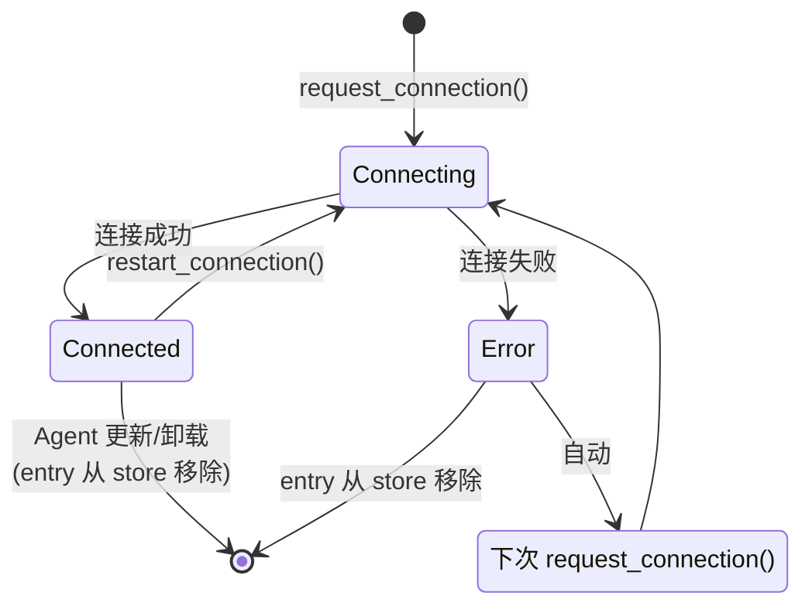

- `Connecting`：持有 `Shared<Task>`，多个消费者可以 await 同一个连接任务
- `Connected`：持有 `AgentConnectedState { connection, history }`
- `Error`：连接失败，entry 从 store 中移除（`agent_connection_store.rs:172`），下次请求会重新创建
- Agent 更新/重装时，旧 entry 被移除（`agent_connection_store.rs:201`），触发重连

---

## 5. 凭证存储策略

### 5.1 核心问题：重启 Zed 后需要重新登录吗？

**答案：通常不需要。** 虽然 Zed 自身不存储凭证，但 Agent 进程运行时继承了用户的 `HOME` 目录，因此 Agent 的凭证文件存储在用户的 home 目录下（而非 Zed 安装目录），跨重启持久化。

下面详细解释为什么。

### 5.2 Agent 二进制安装在 Zed 目录，但凭证不在那里

通过 ACP Registry 安装的 Agent 二进制确实存储在 Zed 的数据目录：

| Agent 类型 | 安装路径 |
|-----------|---------|
| Binary Agent | `~/Library/Application Support/Zed/external_agents/registry/<agent-id>/v_<version>_<hash>/` |
| NPX Agent | `~/Library/Application Support/Zed/external_agents/registry/npx/<agent-id>/` (npm prefix) |
| Extension Agent | `~/Library/Application Support/Zed/external_agents/<extension-id>/<agent-id>/v_<version>/` |

源码位置：`paths.rs:384-390`、`agent_server_store.rs:1371-1491`

**但凭证文件不存储在这些目录中。** 凭证存储位置取决于 Agent 进程的 `HOME` 环境变量，而不是 Agent 二进制的安装位置。

### 5.3 关键机制：Agent 进程继承用户的 HOME

Agent 进程的启动过程（`acp.rs:236-249`）：

```rust
// 1. 使用用户配置的 shell（如 /bin/zsh）包装命令
let shell = TerminalSettings::get(None, cx).shell.clone();
let builder = ShellBuilder::new(&shell, cfg!(windows)).non_interactive();
let mut child = builder.build_std_command(Some(path), &args);

// 2. 添加环境变量（追加模式，不清除已有环境）
child.envs(env);  // std::process::Command::envs() — 追加，不是替换

// 3. 设置工作目录为项目根目录
child.current_dir(cwd);

// 4. 启动进程
Child::spawn(child, ...);
```

**关键点**：`child.envs(env)` 使用的是 `std::process::Command::envs()`，这是 **追加** 模式。Zed 代码中 **没有** 调用 `env_clear()`，也 **没有** 覆盖 `HOME` 环境变量。

因此 Agent 进程完整继承了 Zed 进程的环境变量，包括：

| 变量 | 来源 | 说明 |
|------|------|------|
| `HOME` | 继承自 Zed 进程 | 例如 `/Users/username` |
| `XDG_CONFIG_HOME` | 继承（如果设置了） | 默认未设置 |
| `PATH` | 继承 + 项目 shell 环境 | 包含系统 PATH |

### 5.4 凭证实际存储位置

因为 Agent 进程看到的 `HOME` 就是用户的 home 目录，所以凭证写入的位置与全局安装完全相同：

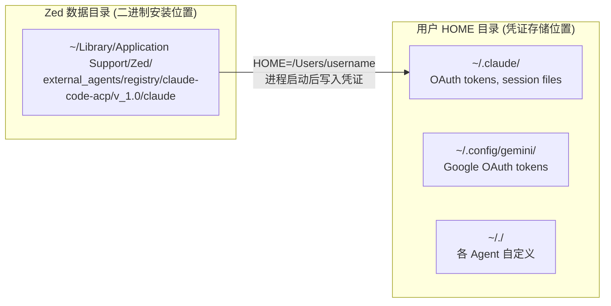

| Agent | 凭证存储位置 | 跨重启持久化 |
|-------|-------------|-------------|
| Claude Code | `~/.claude/` | 是 — 下次启动 Agent 进程时读取已有 token |
| Gemini CLI | 操作系统凭证管理器 / `~/.config/gemini/` | 是 — 凭证管理器独立于进程生命周期 |
| 其他 Agent | `~/.<config>/` (取决于实现) | 取决于 Agent 是否做了持久化 |

### 5.5 重启 Zed 后的完整流程

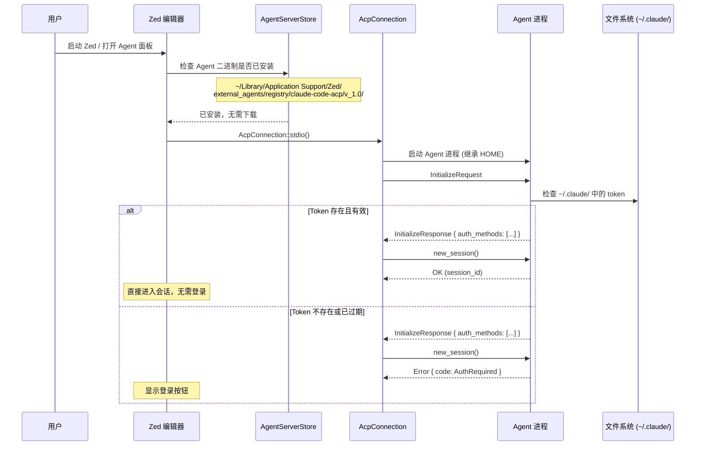

**所以**：
- **首次安装 Agent**：需要登录（Agent 进程的凭证目录还不存在）
- **重启 Zed，凭证未过期**：**不需要重新登录**（Agent 进程启动后读取已有凭证文件，`new_session()` 正常返回）
- **重启 Zed，凭证已过期**：需要重新登录（Agent 进程检测到 token 过期，返回 `AuthRequired`）

### 5.6 Zed 侧不存储凭证的原因

Zed 有意不管理 ACP Agent 凭证，有几个原因：

1. **解耦**：不同 Agent 的认证机制差异极大（OAuth、API Key、CLI 交互式登录、SSO），Zed 无法统一处理
2. **安全**：凭证由 Agent 自己管理，Zed 不接触敏感 token
3. **一致性**：无论 Agent 是通过 ACP Registry 安装还是全局安装，凭证行为完全一致（都写入 `HOME` 目录）
4. **简单性**：Zed 只需一个 `ErrorCode::AuthRequired` 信号就能驱动整个 UI 流程

Zed 侧保存的只是 **内存中的 `AuthState` 枚举**（在 `ConversationView` 中），仅用于控制 UI 渲染。

### 5.7 唯一例外：Gemini API Key

在 `crates/agent_servers/src/custom.rs:346-356` 中，Zed 会从环境变量 `GEMINI_API_KEY` 或系统 Keychain 读取 Gemini API Key，并作为环境变量传递给 Gemini CLI 进程。但这不是 ACP 认证流程的一部分，而是启动 Agent 进程时的配置。

### 5.8 对比：MCP Context Server 的 OAuth 凭证存储

作为对比，MCP Context Server 的 OAuth 认证 **由 Zed 管理并持久化**：

- 使用系统 Keychain 存储 OAuth session（`context_server_store.rs:1174-1217`）
- Key 格式：`mcp-oauth:{server_url}`
- 包含 `access_token`、`refresh_token`、`expires_at`
- 启动时从 Keychain 加载缓存的 session（`context_server_store.rs:795-817`）
- 自动刷新 token（`McpOAuthTokenProvider`）

这两套机制的差异源于架构不同：MCP 的 HTTP transport 需要 Zed 注入 Bearer token，所以 Zed 必须持有 token；而 ACP 是 stdio transport，认证由 Agent 进程内部处理。

---

## 6. 凭证过期与重新认证

### 6.1 检测凭证过期

Zed 不主动检测凭证过期。凭证过期的信号来自 Agent 进程：

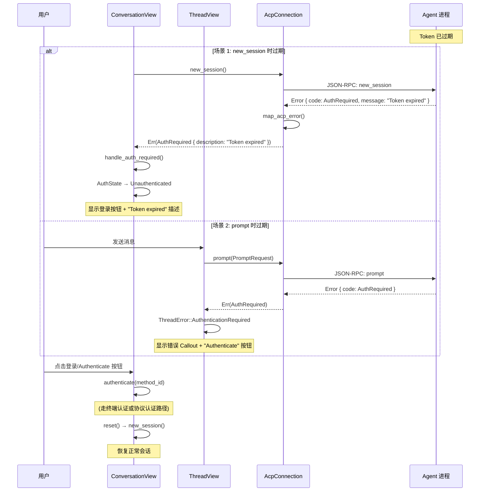

1. **`new_session()` 返回 `ErrorCode::AuthRequired`**  
   → `map_acp_error()` 转换为 `AuthRequired`  
   → `handle_auth_required()` 显示登录 UI

2. **`prompt()` 返回 `ErrorCode::AuthRequired`**  
   → `prompt()` 中检测 `err.code == AuthRequired`  
   → 返回 `acp::Error::auth_required()`  
   → `ThreadError::AuthenticationRequired`  
   → UI 显示错误 + "Authenticate" 按钮

### 6.2 重新认证流程

三种重新认证方式的时序：

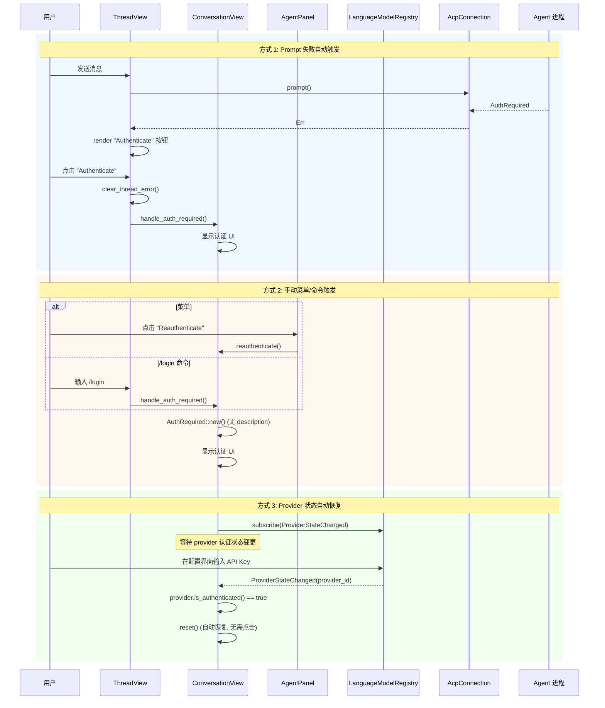

**方式 1：自动触发**（Prompt 失败时）

```
用户发送消息
  → prompt() 失败 → ErrorCode::AuthRequired
    → ThreadError::AuthenticationRequired
      → render_authentication_required_error()
        → "Authenticate" 按钮
          → clear_thread_error() + handle_auth_required()
            → 显示认证 UI，用户重新登录
```

源码位置：`thread_view.rs:8326-8469`

**方式 2：手动触发**（菜单/命令）

- 菜单 "Reauthenticate"：`agent_panel.rs:4044-4046` → `conversation_view.rs:2765-2777`
- `/login` 斜杠命令：`thread_view.rs:977-999`

两者都调用 `handle_auth_required(AuthRequired::new())`，不携带 description（因为是用户主动发起）。

**方式 3：语言模型提供商自动恢复**

如果 `AuthRequired` 包含 `provider_id`（`conversation_view.rs:1171-1201`），Zed 订阅 `LanguageModelRegistry` 事件：

```rust
let sub = window.subscribe(&registry, cx, move |_, ev, window, cx| {
    if let Event::ProviderStateChanged(updated_provider_id) = &ev
        && &provider_id == updated_provider_id
        && provider.is_authenticated(cx)
    {
        this.update(cx, |this, cx| this.reset(window, cx)).ok();
    }
});
```

当用户在提供商配置界面输入 API Key 后，provider 的认证状态变更会自动触发 `reset()`，无需用户再点击按钮。

### 6.3 凭证过期不涉及 Token 刷新

对于 ACP Agent，Zed **不进行** token 刷新。这是因为：
- Zed 不持有任何 token
- Token 的管理（获取、存储、刷新）完全在 Agent 进程内部
- Zed 只通过 `ErrorCode::AuthRequired` 被动感知过期

---

## 7. 关键源码索引

### 协议层

| 文件 | 行号 | 说明 |
|------|------|------|
| `crates/acp_thread/src/connection.rs` | 47-130 | `AgentConnection` trait 定义 |
| `crates/acp_thread/src/connection.rs` | 114 | `auth_methods()` 方法 |
| `crates/acp_thread/src/connection.rs` | 116-122 | `terminal_auth_task()` 方法 |
| `crates/acp_thread/src/connection.rs` | 124 | `authenticate()` 方法 |
| `crates/acp_thread/src/connection.rs` | 336-366 | `AuthRequired` 错误类型 |
| `crates/acp_thread/src/connection.rs` | 25-45 | `build_terminal_auth_task()` 辅助函数 |

### 连接层

| 文件 | 行号 | 说明 |
|------|------|------|
| `crates/agent_servers/src/acp.rs` | 37 | `GEMINI_TERMINAL_AUTH_METHOD_ID` 常量 |
| `crates/agent_servers/src/acp.rs` | 43-59 | `AcpConnection` 结构体 |
| `crates/agent_servers/src/acp.rs` | 323-344 | `InitializeRequest` 发送（声明 auth 能力）|
| `crates/agent_servers/src/acp.rs` | 370-388 | Gemini 硬编码 auth_methods |
| `crates/agent_servers/src/acp.rs` | 515-565 | terminal_auth_task 构建函数 |
| `crates/agent_servers/src/acp.rs` | 906-954 | `AgentConnection` impl（auth 方法）|
| `crates/agent_servers/src/acp.rs` | 975-979 | prompt() 中 AuthRequired 检测 |
| `crates/agent_servers/src/acp.rs` | 1099-1111 | `map_acp_error()` 错误转换 |

### UI 层

| 文件 | 行号 | 说明 |
|------|------|------|
| `crates/agent_ui/src/conversation_view.rs` | 601-609 | `AuthState` 枚举定义 |
| `crates/agent_ui/src/conversation_view.rs` | 740-776 | `reset()` 认证成功后恢复会话 |
| `crates/agent_ui/src/conversation_view.rs` | 877-891 | new_session 失败时捕获 AuthRequired |
| `crates/agent_ui/src/conversation_view.rs` | 1163-1243 | `handle_auth_required()` 核心入口 |
| `crates/agent_ui/src/conversation_view.rs` | 1638-1773 | `authenticate()` 执行认证 |
| `crates/agent_ui/src/conversation_view.rs` | 1840-1965 | `spawn_external_agent_login()` 终端登录 |
| `crates/agent_ui/src/conversation_view.rs` | 1979-2092 | `render_auth_required_state()` 渲染登录 UI |
| `crates/agent_ui/src/conversation_view.rs` | 2765-2777 | `reauthenticate()` 手动重新认证 |

### 连接共享

| 文件 | 行号 | 说明 |
|------|------|------|
| `crates/agent_ui/src/agent_connection_store.rs` | 15-23 | `AgentConnectionEntry` 状态机 |
| `crates/agent_ui/src/agent_connection_store.rs` | 69-73 | `AgentConnectionStore` 结构体 |
| `crates/agent_ui/src/agent_connection_store.rs` | 117-212 | `request_connection()` 连接复用 |
| `crates/agent_ui/src/agent_panel.rs` | 1135-1145 | store 创建（每个 workspace 一个）|
| `crates/acp_tools/src/acp_tools.rs` | 41-78 | `AcpConnectionRegistry` 全局注册 |

### 其他入口

| 文件 | 行号 | 说明 |
|------|------|------|
| `crates/agent_ui/src/conversation_view/thread_view.rs` | 977-999 | `/login` 斜杠命令 |
| `crates/agent_ui/src/agent_panel.rs` | 4044-4046 | "Reauthenticate" 菜单项 |
| `crates/zed_actions/src/lib.rs` | 460-461 | `ReauthenticateAgent` action 定义 |

---

## 总结

| 方面 | 实现方式 |
|------|---------|
| Agent 安装位置 | `~/Library/Application Support/Zed/external_agents/registry/` (二进制和 npx prefix) |
| 凭证存储 | **Zed 不存储**；Agent 进程继承 `HOME`，凭证写入 `~/.claude/` 等用户目录 |
| 重启后是否需登录 | **通常不需要**——Agent 进程启动时读取已有凭证；仅首次或凭证过期时需要 |
| 认证触发 | Agent 返回 `ErrorCode::AuthRequired` 时被动触发 |
| 登录执行 | 终端交互（`SpawnInTerminal`）或协议请求（`AuthenticateRequest`）|
| 登录成功检测 | 输出模式匹配（claude/gemini）或退出码（其他）或 Agent 协议响应 |
| Session 共享 | 同一 Agent 共享一个进程，认证状态在进程内共享 |
| UI 状态 | 每个 `ConversationView` 独立维护 `AuthState` |
| 凭证过期 | 被动感知（Agent 返回 `AuthRequired`），不做 token 刷新 |
| 重新认证 | 自动（prompt 失败时）、手动（菜单/命令）、订阅式（provider 状态变更）|
